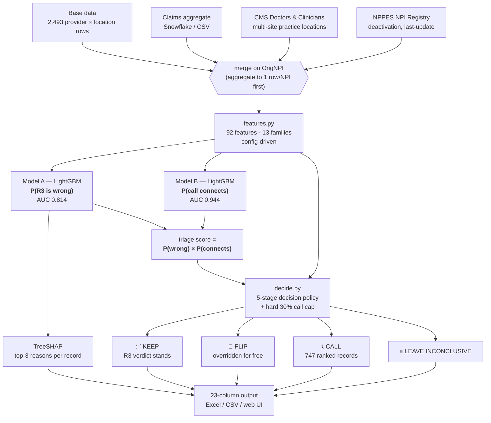
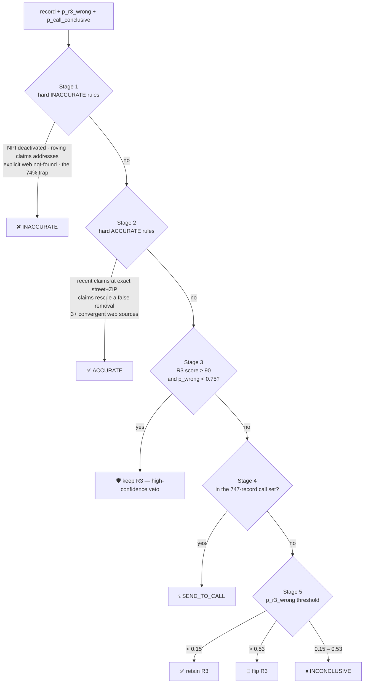

<div align="center">

# R3 Provider-Address Accuracy

### Closing the web-vs-phone accuracy gap in provider directory validation

**54.85% → 75.25% accuracy · +20.40 pp net lift · 95.45% of the agreement zone preserved · $460.75**

[](https://www.python.org/)
[](https://lightgbm.readthedocs.io/)
[](https://shap.readthedocs.io/)
[](https://fastapi.tiangolo.com/)
[](#feature-catalog--92-features)
[](#7--data--sources)

</div>

---

## 📖 Table of Contents

| | |
|---|---|
| [1. What this is](#1--what-this-is) | [8. Decision policy](#8--decision-policy) |
| [2. Headline results](#2--headline-results) | [9. Results in depth](#9--results-in-depth) |
| [3. The problem](#3--the-problem) | [10. Output schema](#10--output-schema) |
| [4. What we found](#4--what-we-found-track-1) | [11. Configuration](#11--configuration) |
| [5. Architecture](#5--architecture) | [12. Reproducing every number](#12--reproducing-every-number) |
| [6. Quick start](#6--quick-start) | [13. Known issues](#13--known-issues--before-you-run-anything) |
| [7. Data & sources](#7--data--sources) | [14. Limitations & roadmap](#14--limitations--roadmap) |

---

## 1. 🎯 What this is

**R3** is HiLabs' provider-attribute validation engine. It scrapes the web, parses pages with an
LLM, classifies with ML, and emits one of three verdicts per provider record:

```
ACCURATE  |  INACCURATE  |  INCONCLUSIVE
```

**The problem:** on ~25% of records R3 disagrees with **Calling QC** — a human phone call to the
office, treated here as ground truth. R3's *web* validation accuracy is 88%: the internet agrees
with R3. The phone does not.

**This repository** is the full solution stack for that gap:

- 🔍 a **diagnosis** of *why* the two sources disagree (Track 1)
- 🧩 a **92-feature multi-source signal layer** that resolves many disagreements passively, with no
  phone call at all (Track 2)
- 📞 a **two-model LightGBM triage cascade** that spends a hard 30% call budget where it buys the
  most accuracy (Track 3)
- 🚀 a **runnable pipeline + FastAPI service** that emits per-record decisions with SHAP-backed
  explanations

> 🔒 **HIPAA-adjacent data.** Nothing in `data/` leaves the team. Only public 10-digit NPIs are sent
> to external APIs (NPPES / CMS) — never names, addresses, or phone numbers.

---

## 2. 📊 Headline results

All figures re-derived from repo artifacts on **2026-07-26**. See
[§12 Reproducing every number](#12--reproducing-every-number) for the exact commands.

<table>
<tr><th align="left">Metric</th><th align="right">Value</th><th align="left">Notes</th></tr>
<tr><td>R3 baseline accuracy</td><td align="right"><code>54.85%</code></td><td>vs Call QC, on the 2,246 rows where Call QC was conclusive</td></tr>
<tr><td><b>Pipeline accuracy</b></td><td align="right"><b><code>75.25%</code></b></td><td>± 0.36 across 10 call-outcome seeds</td></tr>
<tr><td><b>Net accuracy lift</b></td><td align="right"><b><code>+20.40 pp</code></b></td><td>± 0.36</td></tr>
<tr><td><b>Agreement zone preserved</b></td><td align="right"><b><code>95.45%</code></b></td><td>the rubric's hard constraint — do not break what works</td></tr>
<tr><td>Model A — P(R3 wrong), 5-fold CV AUC</td><td align="right"><code>0.8141</code></td><td>from <code>models.pkl</code></td></tr>
<tr><td>Model B — P(call connects), 5-fold CV AUC</td><td align="right"><code>0.9435</code></td><td>from <code>models.pkl</code></td></tr>
<tr><td>Triage precision @ top-200</td><td align="right"><code>98.0%</code></td><td>out-of-fold, not a held-out test set</td></tr>
<tr><td>Triage precision @ top-450</td><td align="right"><code>85.6%</code></td><td></td></tr>
<tr><td>Calls placed</td><td align="right"><code>747 / 747</code></td><td>full utilisation of the 30% cap on 2,493 records</td></tr>
<tr><td>Total cost</td><td align="right"><code>$460.75</code></td><td>747 × $0.50 + 2,493 × $0.035</td></tr>
<tr><td>Feature count</td><td align="right"><code>92</code></td><td>across 13 families, 5 data sources</td></tr>
</table>

**Where the lift comes from.** A controlled ablation — same rows, same folds, same seed, same
algorithm, *only the data sources change*:

| | Web + claims<br>(57 feats) | + staleness & taxonomy<br>(80 feats) | **+ CMS multi-site — FINAL**<br>**(92 feats)** |
|---|:--:|:--:|:--:|
| Model A OOF AUC | 0.8107 | 0.8067 | **0.8138** |
| Average precision | 0.7828 | 0.7825 | **0.7901** |
| Brier score (raw) | 0.1758 | 0.1751 | **0.1696** |
| Precision @ 450 | 0.8400 | 0.8533 | **0.8556** |
| Zone-1 false flags @ 450 | 72 | 66 | **65** |
| Model B AUC | 0.9334 | 0.9328 | **0.9424** |

CMS Doctors & Clinicians was the only addition that improved *every* metric at once, and it cut
agreement-zone contamination at every budget level (`@200: 7→4`, `@300: 15→13`, `@450: 72→65`).
Non-web witnesses (claims + CMS + NPPES + staleness) account for **≈47% of Model A's total gain**.

---

## 3. 🧨 The problem

Two graders, one address, no tiebreaker:

```
                 ┌──────────────────┐
   provider ────▶│  R3 (web scrape) │────▶  ACCURATE / INACCURATE / INCONCLUSIVE
    record       └──────────────────┘                      │
        │                                                  │  ~25% disagree
        │        ┌──────────────────┐                      │
        └───────▶│ Calling QC (phone)│────▶  ground truth ──┘
                 └──────────────────┘
```

A phone call resolves any disagreement — but calls cost **$0.50** each, only **40%** connect to a
human, and operations will not call more than **30%** of the roster. So the real question is not
"who's right?" It is:

> **Which 30% of records should we call, and what do we do with the other 70% for free?**

**Operating constraints**

| Parameter | Value |
|---|---|
| Call budget | 30% of records (hard ceiling) — 747 of 2,493 |
| Call conclusivity rate | 40% (60% hit voicemail / IVR) |
| Effective usable verdicts | ≈ 300 of 747 calls |
| Cost | $0.50 per call · $0.035 per R3 record |
| **Non-negotiable** | do not degrade the ~80% agreement zone |

---

## 4. 🔍 What we found (Track 1)

This is the part that changed the solution. Every number below is computed on the
**both-conclusive** evaluation universe (n = 1,973) unless stated.

### 4.1 R3's *keeps* are far less trustworthy than its *removals*

| R3 said | n | Correct | Read |
|---|--:|--:|---|
| `ACCURATE` (keep) | 450 | **38.7%** | worse than a coin flip |
| `INACCURATE` (remove) | 1,523 | **69.5%** | the reliable half |

R3 **over-removes**: 465 false removals vs 276 missed-bad addresses. Overall agreement on this
sample is 62.4% (production R3 runs ~75% — this Base Data is a deliberately hard slice).

### 4.2 R3's own confidence score is *inverted* at the top

| R3 web-confidence | n | Correct |
|---|--:|--:|
| Score = 100 | 109 | **43.1%** |
| Score ≤ 0 | 1,122 | **73.6%** |

R3's most-confident verdicts are its worst. Confidence cannot be used as a triage signal — it must
be used as a *feature*, and inverted. This single finding is why the triage model is not just
"1 − R3 score".

### 4.3 The gap is geographic and structural, not random

| State | n | Agreement |
|---|--:|--:|
| 🔴 AL | 100 | **6.0%** |
| 🔴 MI | 203 | **24.6%** |
| 🔴 NJ | 155 | **31.0%** |
| 🟢 WA | 42 | 88.1% |
| 🟢 KY | 47 | 89.4% |
| 🟢 NE | 42 | 92.9% |

AL, MI and NJ are near-total failures. They carry a **5× sample weight** in training and a
`feat_state_high_risk` flag — and high-risk state is the **#2 most important feature** in Model A.

Hospital-affiliated physician specialties (Internal Medicine, Cardiology, Pediatrics, OB/GYN) agree
only **2–5%** of the time. Those providers rotate across many real sites; the web finds *a* valid
address for them and R3 marks the roster address wrong.

### 4.4 Claims activity is a strong reliability proxy

| Record has… | Agreement with phone |
|---|--:|
| Claims activity (`N_CLAIMS > 0`, n = 1,223) | **74.0%** |
| No claims activity | **38.6%** |

If somebody is billing from an address, the address is real. This is the backbone of the passive
resolution layer.

### 4.5 The disagreement taxonomy

<table>
<tr><th align="left">Segment</th><th align="right">n</th><th align="left">Signature</th><th align="left">Resolution strategy</th></tr>
<tr>
<td><b>False removals</b><br><i>R3 said INACCURATE,<br>phone said ACCURATE</i></td>
<td align="right"><b>465</b><br>(62.8%)</td>
<td>92% org-validated accurate · 61% had <b>zero</b> confirming pages (web <i>silence</i> read as absence) · 56% hospital-affiliated · AL/MI/NJ carry 38% · <b>all</b> scored ≤25</td>
<td>Claims corroboration + CMS any-site match → <code>RULE_ACC_FALSE_NEGATIVE_RESCUE</code>, <code>RULE_ACC_CLAIMS_RECENT_EXACT</code></td>
</tr>
<tr>
<td><b>False keeps</b><br><i>R3 said ACCURATE,<br>phone said INACCURATE</i></td>
<td align="right"><b>276</b><br>(37.2%)</td>
<td>every single one had ≥1 confirming URL — a <b>stale web echo</b> of an address the provider has left</td>
<td>Staleness scoring (95 confirmed-stale, 15 suspect) + claims-address divergence → <code>RULE_INACC_CLAIMS_MISMATCH_ROVING</code></td>
</tr>
<tr>
<td><b>No external witness</b></td>
<td align="right">253</td>
<td>no claims, not in CMS, not resolvable in NPPES — nothing to triangulate against</td>
<td>Unresolvable passively → highest-value <b>call</b> candidates</td>
</tr>
</table>

**The reframe:** this is not a *scraping quality* problem. It is a **multi-site address problem**
plus a **staleness problem**. The web is often right about *an* address and wrong about *this* one.

---

## 5. 🏗 Architecture



### Why two models?

`P(R3 is wrong)` alone spends the budget on providers who never answer the phone. With a 40%
connect rate, **call-connectivity is a first-class objective, not a nuisance** — so it gets its own
model and the triage score is the *product* of the two. Model B reaches AUC 0.944 because
organisation characteristics predict pickup cleanly; folding that into Model A would only dilute it.

### Why LightGBM?

Native categorical + missing-value handling (absence is `NULL`, never a contradiction), automatic
non-linear interactions, robust at ~2k rows without overfitting, and free gain-based importance for
the explanation layer.

### Protecting the agreement zone

The rubric penalises any degradation of the ~80% zone where R3 and the phone already agree. Three
mechanisms defend it:

1. **Sample weights** — Zone-1 rows (R3 correct) get **3×**; Zone-1 rows in AL/MI/NJ get **5×**.
2. **A high-confidence R3 veto** — if `R3_score ≥ 90` and `p_r3_wrong < 0.75`, R3's verdict stands
   regardless of the model.
3. **A tracked metric** — `zone_accuracy_analysis()` runs inside training and asserts a 95% floor.

---

## 6. 🚀 Quick start

### 6.1 Install

```bash
python -m venv .venv && source .venv/bin/activate

# core
pip install pandas numpy scikit-learn lightgbm shap matplotlib openpyxl pyyaml python-dotenv requests

# web app
pip install fastapi uvicorn jinja2 python-multipart

# optional
pip install snowflake-connector-python   # live Snowflake claims source
pip install anthropic                    # LLM explanations (needs ANTHROPIC_API_KEY)
```

> ⚠️ Use the list above, **not** `pip install -r requirements.txt` — see
> [§13 Known issues](#13--known-issues--before-you-run-anything).

### 6.2 Score records with the pre-trained model (fastest path)

```bash
python pipeline.py "data/raw/Base data_hackathon.xlsx" \
                   data/external/claims_data.csv \
                   outputs/pipeline_output.xlsx
```

Prints staged progress and a JSON summary; writes an Excel workbook with a `Predictions` sheet
(23 columns, one row per record) and a `Summary` sheet.

### 6.3 Retrain both models

```bash
python train.py "data/raw/Base data_hackathon.xlsx" data/external/claims_data.csv
```

Or on the fully enriched dataset (CMS + NPPES + staleness columns already merged — this is the
92-feature configuration that produced the headline numbers):

```bash
python train.py data/processed/Base_enriched_cms.csv empty
```

Writes `models.pkl` (~14 MB bundle), `outputs/oof_predictions.csv`, `features.csv`, and six SHAP
plots. Prints per-fold AUC/AP, Brier before and after isotonic calibration, the best-F1 threshold,
the Zone-1 accuracy check, top-15 features by gain, and triage precision @ top-K.

> ⚠️ `train.py` **overwrites `models.pkl` in place.** Back it up first if the current bundle matters.

### 6.4 Evaluate the decision policy

```bash
python decide.py outputs/oof_predictions.csv
```

Simulates call outcomes across 10 seeds at the 40% connect rate and reports baseline accuracy,
pipeline accuracy, net lift, agreement-zone preservation, calls used and total cost. Writes
`decisions_final.csv`.

> 🐛 The CLI entry point has a tuple-unpacking bug that silently places **zero** calls and reports
> `+2.58 pp`. One-line fix in [§13](#13--known-issues--before-you-run-anything).

### 6.5 Run programmatically

```python
from pipeline import run_pipeline

output_df, summary = run_pipeline(
    base_path='upload.xlsx',
    claims_source='data/external/claims_data.csv',   # or 'empty', or a live Snowflake conn
    models_path='models.pkl',
    output_path='predictions.xlsx',
    explain_mode='auto',        # 'auto' | 'template' | 'llm'
    max_llm_calls=None,         # cost guard
    progress_callback=lambda stage, pct: print(f'[{pct:3d}%] {stage}'),
)
```

### 6.6 Run the web app

```bash
python app.py     # http://0.0.0.0:8000
```

| Route | Purpose |
|---|---|
| `GET /` | Upload form + recent jobs |
| `POST /upload` | Accept base file (+ optional claims CSV) → runs pipeline → returns the .xlsx |
| `GET /jobs` · `GET /jobs/{id}` | Job list · per-job results grid |
| `GET /jobs/{id}/progress` | Progress JSON (polled by the frontend) |
| `GET /jobs/{id}/download` | Download the enriched output |
| `GET /api/jobs/{id}/decisions?filter=CALL` | Paginated decision rows |

> ⚠️ The Jinja templates and `app.css` currently sit at the repo root, but `app.py` looks for
> `templates/` and `static/`. HTML routes will 500 until you move them — see
> [§13](#13--known-issues--before-you-run-anything).

### 6.7 Enrichment scripts (optional, to rebuild the 92-feature dataset)

```bash
# Base + claims + NPPES (public NPIs only leave the machine)
python build_enriched_dataset.py --nppes-live \
    --out data/processed/Base_enriched_merged.csv \
    --save-cache data/external/nppes_cache.json

# + CMS Doctors & Clinicians multi-site features (download DAC_NationalDownloadableFile.csv first)
python cms_dc_enrich.py data/processed/Base_enriched_staleness.csv \
    --cms-bulk /path/to/DAC_NationalDownloadableFile.csv \
    --out data/processed/Base_enriched_cms.csv
```

Enrichment scripts always write a **new** file — they never overwrite an existing enriched dataset.

---

## 7. 🗂 Data & sources

### 7.1 Files in this repo

| File | Shape | Description |
|---|---|---|
| `data/raw/Base data_hackathon.xlsx` | 2,493 × 55 | Labelled records. Sheet `Base Data`, **header row = 1**. Grain is **provider × location**, not one row per provider. |
| `data/external/claims_data.csv` | 1,950 × 11 | Snowflake-aggregated claims, keyed on `BASE_NPI` |
| `data/processed/Base_enriched_cms.csv` | — | Final training dataset: base + claims + NPPES + staleness + CMS |
| `data/processed/Base_enriched_staleness.csv` | — | Intermediate (80-feature ablation step) |
| `data/external/nppes_sample.json` | — | Cached NPPES responses for offline runs |
| `models.pkl` | ~14 MB | Both models + both SHAP explainers + feature schema + CV metrics |
| `outputs/oof_predictions.csv` | 2,493 rows | K-fold out-of-fold predictions on **every** input row, plus per-record SHAP columns and top-3 reasons |
| `outputs/pipeline_output.xlsx` | — | Sample end-to-end pipeline output |
| `docs/CEO_presentation_handoff.md` | — | Fact-checked, provenance-tagged brief for the deck |

> ⚠️ `data/processed/R3_Claims_Merged_data.csv` is **not** merged — it is byte-identical to
> `claims_data.csv`. Don't trust the name; use `Base_Claims_merged_PROPER.csv` or the enriched files.

### 7.2 Join discipline

The join key is **`OrigNPI` (plaintext) ↔ `BASE_NPI`**. Three traps, all handled:

1. **Key as string, always.** `BASE_NPI` carries a `.0` float tail.
2. **Aggregate to one row per NPI before joining.** `OrigNPI` has **515 duplicate values** (one
   provider, several locations); a raw join fans rows out.
3. **Absence is `NULL`, not contradiction.** Every source gets a `*_found` flag. Only ~28.7% of
   practitioners are linked to orgs in CMS files — missing ≠ invalid provider.

**Coverage:** 2,464 of 2,493 base rows have a claims key; 1,223 have `N_CLAIMS > 0`. 29 rows have no
`OrigNPI` at all — kept, flagged `has_external_key = 0`.

> 🧹 The hashed 32-char `NPI` column was **removed** (2026-07-15). It joined to nothing and produced
> a degenerate always-fires feature. Backups live in `data/_backups_pre_npi_removal/`.

### 7.3 External witnesses

| Source | Key | What it adds | Measured gain share |
|---|---|---|--:|
| **Billing claims** (Snowflake) | `BASE_NPI` | Volume, recency, distinct orgs/addresses, street+ZIP match — proof of *current* practice | **29.0%** |
| **Web evidence cube** (R3 scrape) | — | 12 raw URL counts across provider/org views × org/provider/aggregator sources | **25.9%** |
| **CMS Doctors & Clinicians** ([`mj5m-pzi6`](https://data.cms.gov/provider-data/dataset/mj5m-pzi6)) | `NPI` | One row per clinician × enrollment × group × address → the **multi-site X-ray** | **15.9%** |
| R3 internals / geography / provider attrs | — | Score, credentials, state risk tier, org linkage | ~25% |
| **Hospital taxonomy** (NUCC) | taxonomy code | Rotation-prone specialty classification | 2.3% |
| **Staleness** (derived) | — | Days since claim / NPPES update, anchored to `2026-04-30` | 1.8% |
| **NPPES** NPI Registry | `NPI` | Deactivation, last-update date, practice vs mailing divergence | **0.3%** |

**Surprising finding:** the strongest *new* signal is `feat_cms_max_group_size` — organisational
group size, not any address match. Big-system membership is itself the multi-site risk marker, and
it is Model A's **#3 feature by gain**.

NPPES contributed almost nothing measurably. It is retained only because `feat_nppes_found`
disambiguates "absent from the registry" from a real zero.

---

## 8. ⚖️ Decision policy

`decide.py` runs a **5-stage cascade** per record. Deterministic rules fire before the model, so an
unambiguous external witness always beats a probability.



### 8.1 Call-set selection — 3 priorities × 2 passes, hard-capped

The cap is `floor(n × 0.30)`. Records are bucketed, sorted, then truncated at the cap.

| | Pass 1 · `P(connect) ≥ 0.75` | Pass 2 · `0.65 ≤ P(connect) < 0.75` |
|---|---|---|
| **Priority 1** | R3 returned `INCONCLUSIVE` | same, only if the cap isn't full |
| **Priority 2** | model-inconclusive · `0.14 ≤ p_wrong ≤ 0.54` | ″ |
| **Priority 3** | likely wrong · `0.53 ≤ p_wrong ≤ 0.75` | ″ |

Priorities are mutually exclusive (highest wins). Within a priority, records rank by
`P(connect)` descending. A **hospital IVR guard** removes hospital-linked records with
`P(connect) < 0.30` from eligibility entirely — no point burning budget on a phone tree.

Note what is *not* called: records where `p_wrong > 0.75`. The model is confident enough to flip
those for free, so the budget goes to genuine uncertainty instead.

### 8.2 Thresholds

| Constant | Value | Role |
|---|--:|---|
| `MAX_CALL_FRACTION` | `0.30` | hard operational ceiling on the call pool |
| `KEEP_THRESHOLD` | `0.34` | below this, R3's answer stands |
| `FLIP_THRESHOLD` | `0.80` | confident-failure passive flip |
| `CALL_YIELD` | `0.40` | assumed connect rate (simulation input) |
| `PCONC_PASS1_MIN` / `PASS2_MIN` | `0.75` / `0.65` | two-pass connectivity gates |
| `PWRONG_INCONC_LOW` / `HIGH` | `0.14` / `0.54` | model-inconclusive band |
| `PWRONG_LIKELY_LOW` / `HIGH` | `0.53` / `0.75` | likely-wrong band |
| `HOSPITAL_PCONC_MIN` | `0.30` | hospital IVR-waste guard |

### 8.3 Reason codes

Every record carries a machine-readable `decision_reason_code`:

| Code | Meaning |
|---|---|
| `RULE_INACC_NPI_DEACTIVATED` | NPI is deactivated in NPPES |
| `RULE_INACC_CLAIMS_MISMATCH_ROVING` | ≥2 distinct claims addresses, none matching the roster ZIP |
| `RULE_INACC_WEB_EXPLICIT_NOT_FOUND` | web explicitly says not-found (not merely silent) |
| `RULE_INACC_74_PERCENT_TRAP` | claims ZIP present but unmatched **and** web comment empty |
| `RULE_ACC_CLAIMS_RECENT_EXACT` | recent billing at the exact street + ZIP — strongest single signal |
| `RULE_ACC_FALSE_NEGATIVE_RESCUE` | R3 said INACCURATE but claims strongly corroborate |
| `RULE_ACC_WEB_CONVERGENCE` | ≥3 independent web sources confirm |
| `ML_VETO_R3_HIGH_CONFIDENCE` | R3 score ≥ 90 and the model isn't strongly against it |
| `TRIAGED_TO_CALL` | selected into the 747-record call queue |
| `RETAIN_R3_LOW_PWRONG` | `p_wrong < 0.15` |
| `FLIP_R3_HIGH_PWRONG` | `p_wrong > 0.53`, not called → flipped passively |
| `MODEL_INCONCLUSIVE_NOT_CALLED` | uncertain and out of budget |

---

## 9. 📈 Results in depth

### 9.1 Where the 2,493 records land

Measured from `outputs/oof_predictions.csv`:

| Decision | n | Share |
|---|--:|--:|
| ✅ Retain R3's verdict | 1,127 | 45.2% |
| 📞 Send to robocall | **747** | 30.0% |
| 🔄 Flip passively — **free accuracy** | **354** | 14.2% |
| ⏸ Leave inconclusive | 265 | 10.6% |

354 records get corrected **at zero marginal cost** — that is the entire point of the signal
engineering layer.

### 9.2 Triage precision @ top-K (Model A, out-of-fold)

| Top-K | Precision | True R3 errors captured |
|--:|--:|--:|
| 50 | **98.0%** | 49 |
| 100 | **99.0%** | 99 |
| 200 | **98.0%** | 196 |
| 300 | 95.7% | 287 |
| 450 | 85.6% | 385 |
| 600 | 75.2% | 451 |
| 800 | 66.0% | 528 |

<details>
<summary><b>Why is precision 98% at top-200 when global AUC is only 0.81?</b> (this looks like leakage — it isn't)</summary>

<br>

The head of the ranking is heavily concentrated in segments where R3's true agreement rate is
6–31%. In the top-200: **MI 80 · NJ 58 · AL 49 · NY 13**, and by specialty **Internal Medicine 42 ·
Cardiology 25 · Pediatrics 21 · OB/GYN 20**. Those buckets are near-purely positive, so top-decile
precision is very high while *global* separation stays moderate.

There genuinely **was** a leak earlier: `prepare_X` passed the `target` column
(`R3 != CallQC` — the label itself) into the feature matrix, which produced a fake **1.00** triage
precision. It is fixed at [`train.py:113-118`](train.py#L113-L118), which now drops
`target`, `y_r3_wrong`, `y_call_conclusive`, `CallQC` and `R3` from `X`. Every number in this README
is post-fix. Two other bugs were fixed in the same pass: a broadcast crash from pre-filtering `df`
to the both-conclusive subset (which also starved Model B, that must see all rows), and the missing
Model-B row mask.

Sample weights are label-derived (Zone-1 = 3×), which is legitimate cost-sensitive learning:
weights affect *training only*, and every metric reported here is out-of-fold.

</details>

### 9.3 Top features by gain (Model A)

| # | Feature | Source |
|--:|---|---|
| 1 | `feat_claims_n` | Claims |
| 2 | `feat_state_high_risk` | Geography |
| 3 | `feat_cms_max_group_size` | **CMS** |
| 4 | `feat_r3_score_numeric` | R3 internals |
| 5 | `feat_ev_total` | Web evidence |
| 6 | `feat_claims_days_since` | Claims |
| 7 | `feat_ev_total_not_found` | Web evidence |
| 8 | `feat_ev_found_ratio` | Web evidence |
| 9 | `feat_ev_pv_nf_agg_n` | Web evidence |
| 10 | `feat_cms_num_practice_locations` | **CMS** |

SHAP plots (bar, beeswarm, and a Zone-1 vs Zone-2 comparison) for both models are in `outputs/`.

### 9.4 Explainability

Every record carries a **top-3 SHAP reason string** — computed per validation fold during training
(so it is out-of-fold) and via the pickled `TreeExplainer` at inference:

```
feat_claims_n(+0.42→wrong) | feat_state_high_risk(+0.31→wrong) | feat_ev_found_ratio(-0.18→right)
```

On top of that, `llm_explainer.py` produces a one-sentence human-readable explanation. With
`ANTHROPIC_API_KEY` set and `explain_mode='auto'` it uses Claude Haiku (~$0.0001/record); without
it, a deterministic template explainer produces equivalently structured output. **Every LLM call is
individually wrapped in try/except** and falls back to the template — the pipeline never fails
because of the explainer.

---

## 10. 📤 Output schema

23 columns per record (`pipeline.OUTPUT_COLUMNS`):

| Group | Columns |
|---|---|
| **Identifiers** | `Row ID`, `OrigNPI`, `FirstName`, `LastName`, `Specialty`, `Address1`, `City`, `State`, `Zip`, `Phone`, `OrganizationName` |
| **Original verdict** | `R3_label` · `R3_score` (0–100) |
| **Model output** | `p_r3_wrong` (Model A) · `p_r3_wrong_confidence` = `max(p, 1−p)` · `p_call_conclusive` (Model B) · `triage_priority` = the product |
| **Decision** | `final_label` (`ACCURATE`/`INACCURATE`/`INCONCLUSIVE`/`SEND_TO_CALL`) · `decision` (`KEEP`/`FLIP`/`CALL`/`LEAVE_INCONCLUSIVE`) · `decision_reason_code` · `decision_explanation` · `should_send_to_robocall` · `in_call_pool_priority_rank` (1 = call first, `NaN` if not in pool) |

The Excel writer adds a **Summary** sheet: total records, records with claims, the four decision
counts, the call cap, pool utilisation, and estimated total cost.

---

## 11. ⚙️ Configuration

`feature_config.yaml` is the single control surface for feature engineering — **edit this, not
`features.py`.**

```yaml
families:                    # 15 switches — turn whole families on/off
  claims_raw:      true
  cms_dc:          true      # CMS multi-site (needs cms_* columns present)
  staleness:       true      # R3=ACCURATE-gated, anchored to AS_OF 2026-04-30
  nppes_registry:  true
  hospital_specialty: true
  # ...

features:                    # drop individual features within a family
  feat_specialty_length: true
  feat_has_middle_name:  true

thresholds:                  # rule-feature cut points
  claims_high_volume_min:        20
  claims_recent_days:            180
  claims_strong_corroborate_min: 3
  claims_strong_contradict_min:  20

categorical_features:        # handled natively by LightGBM
  - feat_state
  - feat_zip_prefix
  - area_code

high_risk_states: [AL, MI, NJ]   # drives feat_state_high_risk (5× sample weight)
```

> 🔁 **Any config change requires a retrain.** `models.pkl` is pinned to the exact `feature_cols`
> schema it was trained on — running the pipeline against a stale bundle produces garbage, not an
> error. Always `python train.py …` after touching the config.

### Feature catalog — 92 features

| Family | # | Covers |
|---|--:|---|
| `evidence_cube_raw` + `evidence_rollups` | 16 | 12 raw URL counts (provider/org view × org/provider/aggregator source) + totals and found-ratio |
| `claims_raw` + `claims_derived` | 15 | volume, distinct orgs/addresses, days-since, ZIP and street+ZIP match tiers, log-volume, high-volume, strong-corroborate / strong-contradict |
| `cross_view_agreement` + `specialty_provenance` + `org_linkage` | 14 | provider-view vs org-view patterns, source diversity, PIO evidence, low-claim specialty, hospital-affiliated specialty |
| `cms_dc` | 11 | practice locations, states, org affiliations, **max group size**, telehealth, multi-site flag, any-location match tier, multi-site-no-match, CMS × R3-inaccurate interaction |
| `staleness` | 10 | days since claim / NPPES update, min-days, over-90 (directory rule), moved-elsewhere, 4-way fresh/suspect/confirmed/unknown flags |
| `nppes_registry` | 8 | found, deactivated, days-since-update, practice ≠ mailing, location count, multi-location, match tiers |
| `r3_internals` + `cross_interactions` | 5 | score, high-confidence flag, name-change signal, R3-accurate × claims-contradict, R3-inaccurate × claims-corroborate |
| `hospital_specialty` interactions | 5 | hospital × R3-inaccurate / R3-accurate / web-silent / org-linked / CMS-multisite |
| `provider_attributes` | 4 | credentials, MD/DO, mid-level, NPI deactivated |
| `geography` + `org_linkage` | 3 | high-risk state, org-is-hospital, org-is-missing |

> ℹ️ `cat_cols` in the shipped `models.pkl` is **empty** — the three configured categoricals
> (`feat_state`, `feat_zip_prefix`, `area_code`) are not present in the enriched feature frame, so
> all 92 features are currently numeric. Worth revisiting: raw state is likely informative beyond
> the binary high-risk flag.

### Data quality notes

| Issue | Detail |
|---|---|
| `ANP` | mixes `Y`/`N` with `YES`/`NO` (7 stray values) |
| `Org_Validation` | one stray `0` + 3 nulls |
| `County` | ~41% missing |
| `MiddleName` | ~44% missing |
| `OrigNPI` | 515 duplicate values, 29 missing |

---

## 12. 🔬 Reproducing every number

Every figure in this README is derivable from a committed artifact. No number was carried over
from an earlier revision without re-deriving it.

<details>
<summary><b>Model metrics, feature count, importances</b></summary>

```python
import pickle, pandas as pd
b = pickle.load(open('models.pkl', 'rb'))
print(len(b['feature_cols']))            # 92
print(b['cv_auc_r3_wrong'])              # 0.8141069905488882
print(b['cv_auc_call_conclusive'])       # 0.9435435561009854
print(pd.Series(b['feature_importance_r3_wrong']).sort_values(ascending=False).head(15))
```
</details>

<details>
<summary><b>Accuracy, lift, zone preservation, cost, decision counts</b></summary>

```python
import pandas as pd, numpy as np, decide
df = (pd.read_csv('outputs/oof_predictions.csv')
        .rename(columns={'oof_p_r3_wrong': 'p_r3_wrong',
                         'oof_p_call_conclusive': 'p_call_conclusive'}))
call_set, rank_map = decide.select_call_set(df)          # note the tuple unpack
dec = df.apply(lambda r: decide.apply_decision(r, call_set), axis=1)
df['decision_label']  = [d[0] for d in dec]
df['decision_reason'] = [d[1] for d in dec]

res = pd.DataFrame([decide.evaluate_one_run(decide.simulate_call_outcomes(df, seed=s))
                    for s in range(10)])
print(res.baseline_acc.mean(),  # 0.5485
      res.pipeline_acc.mean(),  # 0.7525 ± 0.0036
      res.lift_pp.mean(),       # +20.40 ± 0.36
      res.az_preserved.mean(),  # 0.9545
      res.n_calls.mean())       # 747
print(df.decision_reason.value_counts())
```
</details>

<details>
<summary><b>Discovery statistics (§4)</b></summary>

```python
import pandas as pd
d  = pd.read_csv('outputs/oof_predictions.csv')
bc = d[d.both_conclusive == True]                       # n = 1,973
(bc.R3 == bc.CallQC).mean()                             # 0.6244  overall agreement
bc[bc.R3 == 'ACCURATE'].pipe(lambda s: (s.R3 == s.CallQC).mean())    # 0.3867
bc[bc.R3 == 'INACCURATE'].pipe(lambda s: (s.R3 == s.CallQC).mean())  # 0.6947
bc.groupby('State').apply(lambda x: pd.Series(
    {'n': len(x), 'agree': (x.R3 == x.CallQC).mean()})) # AL 6.0% · MI 24.6% · NJ 31.0%
```
</details>

### ⚠️ Honesty limits on these numbers

- Precision@K figures are **out-of-fold**, not from a held-out test set.
- `75.25%` assumes the stated **40% call conclusivity** and that a connected call returns ground
  truth. That yield is a problem-statement *input*, not something measured here.
- The `54.85%` baseline counts R3's `INCONCLUSIVE` as a miss across all Call-QC-conclusive rows. On
  the both-conclusive subset alone R3 scores **62.44%** and the lift is correspondingly smaller.
  Both framings are true; `54.85 → 75.25` is the business metric.
- In the `decide.py` OOF evaluation, `outputs/oof_predictions.csv` carries only label and score
  columns, so the **Stage 1–3 deterministic rules cannot fire** — the reported lift comes from the
  threshold + triage policy alone. Those rules *do* fire in the full `pipeline.py` path, where the
  feature frame is present.
- Base Data agreement is **62.4%**, while production R3 runs ~**75%**. This is a hard, small,
  deliberately adverse sample; 62% is not the production number.
- No algorithm bake-off was run (LightGBM was chosen, not benchmarked). No threshold-tuning study,
  no drift-monitoring plan, no automated test suite.

---

## 13. 🐛 Known issues — before you run anything

These are real, currently in the tree, and each has a stated fix. Nothing here is hidden.

| # | Issue | Impact | Fix |
|--:|---|---|---|
| 1 | [`decide.py:321`](decide.py#L321) calls `select_call_set(df)` **without unpacking** the returned `(call_set, rank_map)` tuple | The CLI reports "Call set: 2 records", **zero calls are ever placed**, and prints `+2.58 pp` instead of `+20.40 pp`. `pipeline.py:205` unpacks correctly, so the app path is fine — but anyone cloning and running the CLI sees the wrong number. | `call_set, rank_map = select_call_set(df)` |
| 2 | [`decide.py`](decide.py) defines `select_call_set` **twice** (lines 71 and 133) and re-imports numpy/pandas mid-file. `MAX_CALL_FRACTION` is also defined twice. | The second definition wins; the first is dead code. Both cap values agree, so no wrong behaviour — but two sources of truth. | Delete lines 71–131 and the duplicate constant |
| 3 | [`Dockerfile`](Dockerfile) is **entirely commented out** except `FROM python:3.9-slim` | `docker-compose up --build` builds an empty image and runs nothing | Uncomment the body |
| 4 | `docker-compose.yaml` maps `5000:5000`, but `app.py` serves on **8000** | Even with a working Dockerfile the app is unreachable | Change the mapping to `8000:8000` |
| 5 | `app.py` expects `templates/` and `static/`, but `base.html`, `upload.html`, `jobs.html`, `results.html` and `app.css` all sit at the **repo root** | All HTML routes 500 | `mkdir templates static && mv *.html templates/ && mv app.css static/` |
| 6 | `requirements.txt` is stale: missing `fastapi`, `uvicorn`, `jinja2`, `pyyaml`, `matplotlib`, `requests`; lists `dotenv` (a different package than the `python-dotenv` actually imported) and `pandas-profiling` (unused, and it conflicts with modern pandas) | `pip install -r requirements.txt` yields a non-working environment | Use the [§6.1](#61-install) list; regenerate the file |
| 7 | [`app.py:30`](app.py#L30) imports `snowflake.connector` **unconditionally**, but the Snowflake block that uses it is commented out | Hard dependency on a package that is nominally optional; `claims_source='snowflake'` silently falls back to `'empty'` | Move the import inside the block, then uncomment it and set `SNOWFLAKE_*` env vars |
| 8 | [`pipeline.py:51`](pipeline.py#L51) imports `load_dotenv` but never calls it | `.env` is loaded only if some other module happens to do it | Call `load_dotenv()` at module top |
| 9 | `pipeline.py` calls `explain_records` **twice** (lines 201 and 232); only the second result reaches the output | Wasted compute, and doubled LLM spend when `explain_mode='llm'` | Delete the line-201 call |
| 10 | `Call qc extractor.py` has a **space** in its filename | Cannot be imported as a module | It's a one-off preprocessing script — invoke it, don't import it |
| 11 | No test suite, linter, or formatter is configured | Verification is manual: inspect `outputs/oof_predictions.csv` after training and run the pipeline end-to-end | — |

---

## 14. 🧭 Limitations & roadmap

### What this doesn't do yet

- **No authentication** on the web app — anyone with the URL can upload. Add SSO before exposing it.
- **In-process worker** — the pipeline runs synchronously in the request. Beyond ~5 concurrent users,
  move to Celery/RQ + Redis.
- **Snowflake path is untested end-to-end** — `claims_loader.load_from_snowflake` is implemented but
  has never run against a live warehouse from this environment. The CSV and `'empty'` paths are both
  verified.
- **253 records have no external witness at all** — no claims, not in CMS, not resolvable in NPPES.
  Nothing can triangulate them; they can only be called.

### Priority-ordered next steps

1. **Fix the 11 items in [§13](#13--known-issues--before-you-run-anything)**, starting with the
   `decide.py` unpack bug — it makes the repo understate its own result by 18 pp.
2. **Restore the categorical features.** `cat_cols` is empty; raw state and ZIP prefix are almost
   certainly informative beyond the binary high-risk flag.
3. **Scale CMS from sample to the full National Downloadable File** (~2.5M rows). CMS already
   delivers 15.9% of gain from partial coverage.
4. **Threshold-tuning study.** The 8 policy constants in `decide.py` were set by hand, not swept.
   A per-release re-tune at a fixed operating point is the cheapest remaining win.
5. **Algorithm bake-off + calibration in production.** Isotonic calibration is computed during
   training but the *uncalibrated* model is what ships in `models.pkl`.
6. **Held-out test set.** Every number here is out-of-fold; a true holdout would settle the
   "is top-200 precision real?" question definitively.
7. **Drift monitoring.** Claims recency and CMS group size will both drift; there is no plan yet.

### Roadmap for external sources

| Source | Status | Expected value |
|---|---|---|
| CMS Doctors & Clinicians full file | Sample integrated | High — already the best new signal |
| NUCC taxonomy crosswalk | Partial | Medium — normalises specialty codes |
| NPPES bulk dissemination file | API sample only | Low measured (0.3%), but useful for deactivation checks |
| State licensing / FSMB · DEA | Not started | Unknown — evaluate cost vs lift before buying |
| USPS CASS / DPV standardisation | Not started | Medium — would sharpen every address match tier |

---

<div align="center">

### 🏆 Hackathon deliverables map

| Track | Deliverable | Where |
|---|---|---|
| **1 — Pattern Analysis** *(mandatory)* | Disagreement taxonomy + per-segment resolution strategy | [§4](#4--what-we-found-track-1) · `notebooks/` · `outputs/*.png` |
| **2 — Signal Engineering** | Multi-source triangulation, precision/recall vs Call QC | [§7.3](#73-external-witnesses) · [§9](#9--results-in-depth) · `features.py` |
| **3 — Robocalling Triage** | Scoring model + accuracy-lift simulation under budget | [§8](#8--decision-policy) · `decide.py` · `train.py` |
| Code + README + data-quality report | This file · `docs/` | — |
| Runnable output on unseen holdout | `pipeline.py` · `app.py` | [§6](#6--quick-start) |
| Presentation | `R3_Hackathon_Deck_quarter_final.pptx` · `docs/CEO_presentation_handoff.md` | — |

**Rubric:** Validation accuracy 35 · Problem-discovery depth 20 · Cost efficiency 20 ·
Feasibility & scalability 15 · Presentation 10

*Numbers last re-derived from repo artifacts on 2026-07-26.*

</div>
